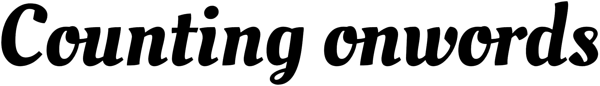

  

## 🚀 what

Simple site built with React, trying out Hooks.   

## 🤷 what to do

Paste your text and see how many characters and words are in there

## 👴 what used to do

Shoutout to www.countmywords.com which has been used during all of my time in Uni

## 
